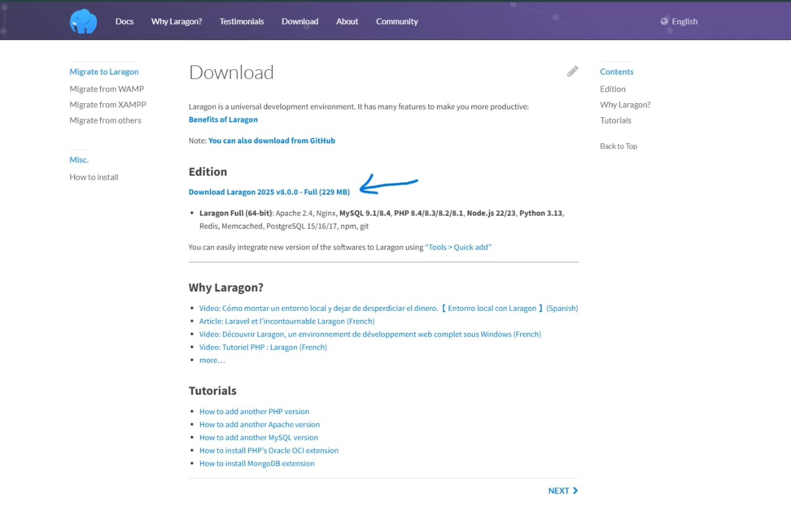
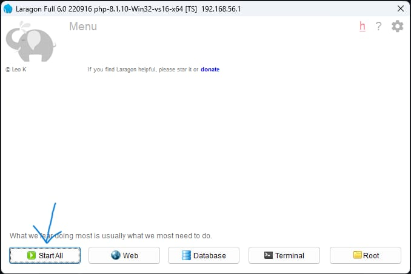
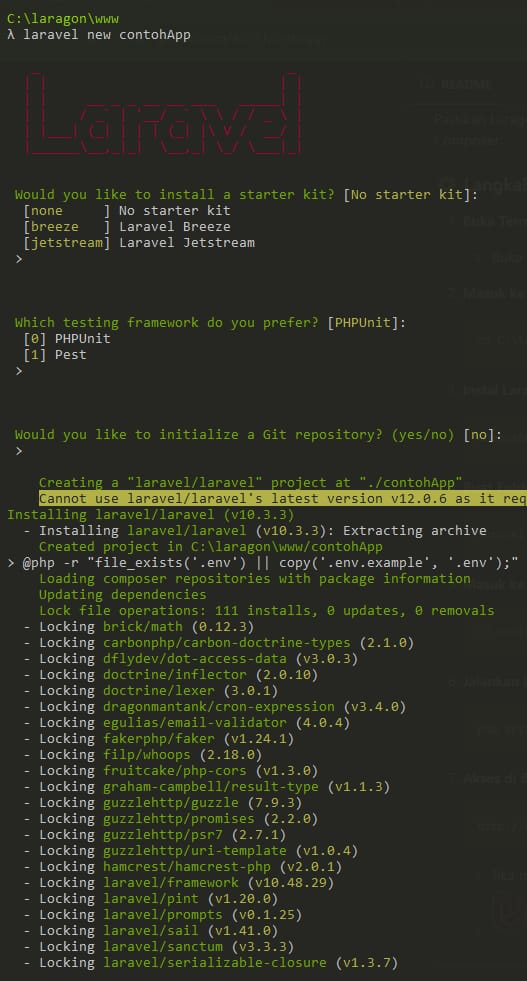
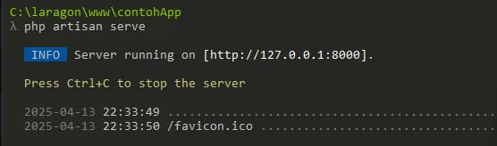

# 🚀 Tutorial Instalasi Laravel dengan Laragon (Windows)

Panduan lengkap instalasi Laravel dari awal sampai akhir menggunakan **Laragon** di sistem operasi **Windows**.

---

## 📸 Preview

Tampilan awal Laravel:

---

## 📦 1. Download & Install Laragon

1. Kunjungi [https://laragon.org/download](https://laragon.org/download)
2. Download versi **Laragon Full**
3. Jalankan installer dan ikuti langkah-langkah berikut:
   - Pilih folder instalasi (contoh: `C:\laragon`)
   - Centang "Start All Services" jika ingin langsung berjalan otomatis

4. Setelah selesai, buka Laragon dan klik **Start All**

---

## 🧪 2. Cek PHP & Composer

Buka terminal Laragon:

Menu > Tools > Terminal

Ketik perintah berikut:

php -v
composer -V

⚙️ 3. Install Laravel

ketik "composer global require laravel/installer"

Akses via browser: http://127.0.0.1:8000

